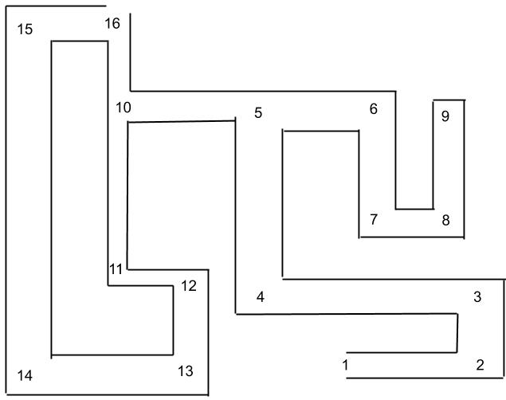
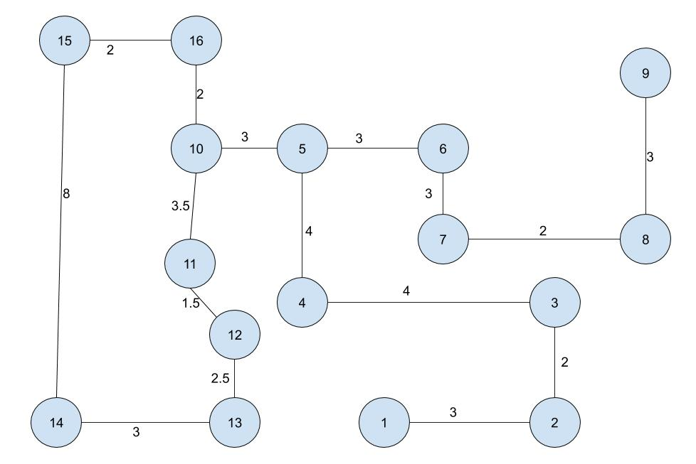
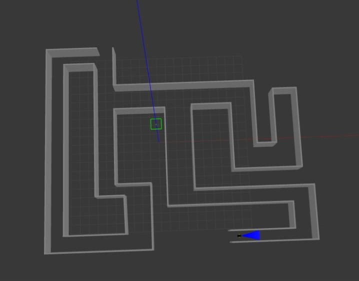
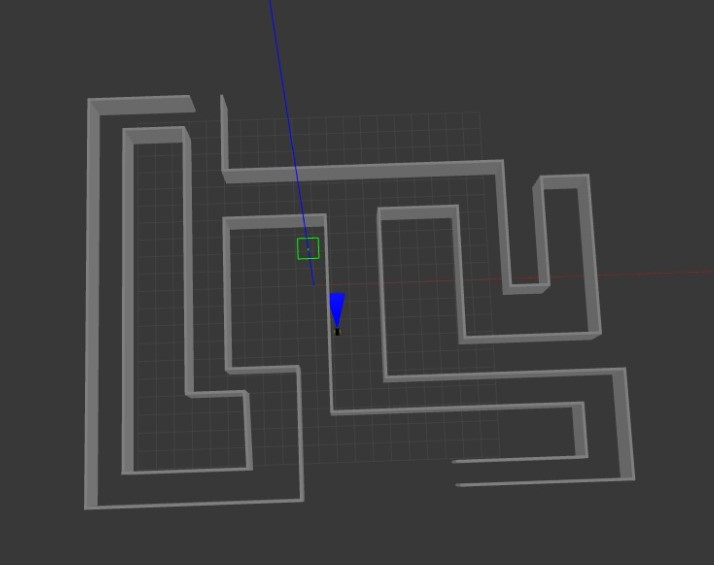
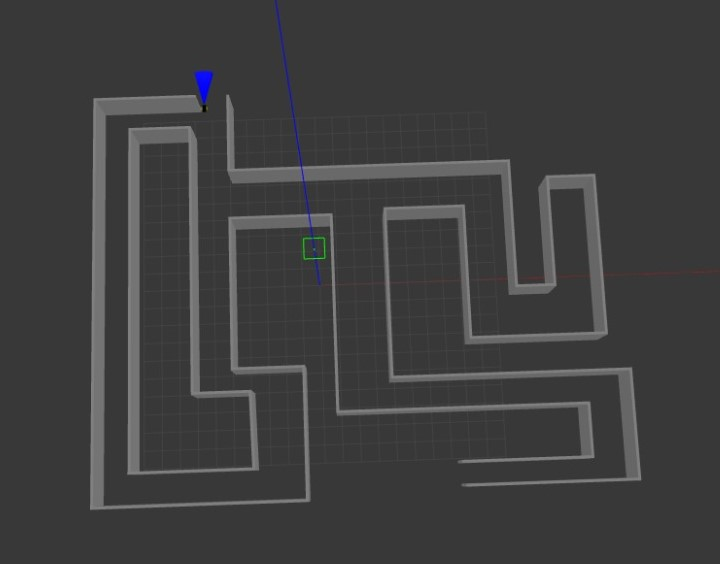

# ROS-Maze-Solver

# Introduction

This project is an implementation of a Maze Solver. The project was
meant to have a hardware implementation, however given Covid-19
lockdown, the hardware implementation was not finished. Instead a
simulation on Gazebo was created.

The robot is given a certain maze. Accordingly, the Uniform Cost Search
algorithm is implemented and used to obtain the shortest path to the
exit of the maze. Hence, according to the obtained path, the robot moves
until it detects an obstacle using the ultrasonic sensor which marks
reaching a node. The robot then moves according to the given shortest
path, using the readings from the filtered IMU sensor reading, and the
rotation is done using a rotation server. The process is repeated until
the destination is reached.

This maze solver is a simple implementation that can be used to build a
navigation robot moving from one place to another using a previously
stored map; it finds the shortest path and follows it. Moreover, this
robot can be adopted in several fields, such as medical emergencies.

# Our Implementation

## Logic Overview

The main concept in our maze solver implementation is to describe the
maze using a text file. The text file is written in a specific format
that can be interpreted by our code which outputs the graph
corresponding to the maze. Each node in our graph contains the following
information:

1.  ID of the current node.

2.  Other nodes connected to the current node.

3.  Cost of going from the current node to each one of the connected
    nodes.

4.  Angle of rotation needed to move from the current node to each of
    the connected nodes.

Now that we have our maze in a graph form, the user can now choose the
start and end points by specifying the IDs of the corresponding nodes.
Next, we use uniform cost search algorithm to solve for the shortest
path between these two nodes. Figure [1](#fig:maze_samp), shows a sample
maze, and figure [2](#fig:graph) shows the graph corresponding to this
maze.

Using the path obtained by the uniform cost search algorithm we start
moving the robot forward until its ultrasonic sensor detects that the
wall is close. When the ultrasonic sensor reads a very close distance,
our program interprets this reading that the robot has now travelled to
the next node. Therefore, the program will fetch the next node in the
shortest path, and identify the angle needed to rotate the robot to go
to the next node. The program will instruct the robot to rotate with the
specified angle then start moving forward to the next node. This
procedure is repeated until the robot reaches the destination.

## ROS Implementation

A gazebo simulation was implemented to simulate the robot solving the
maze shown in figure [1](#fig:maze_samp). The simulation publishes the
readings of IMU and ultrasonic sensor, and subscribes to a topic to
receive the robot’s motors’ speeds. Accordingly, another node is used to
filter the noise out of the IMU sensor readings and publish the yaw,
pitch, and roll. After that, there is the main logic node that takes the
text file containing the maze as an input and then:

1.  Builds the graph corresponding to the maze.

2.  Finds a solution to the graph from the specified start and end nodes
    using Uniform Cost Search (UCS) algorithm.

3.  Works with another node that implements PID controller on the robot,
    and tells it how to move the robot according to the following
    algorithm:
    
    1.  When the robot wants to travel from a node to another one in the
        graph, the PID controller node tries to control the angle so
        that the robot stays on track and moves in a straight line.
    
    2.  Then, if the ultrasonic sensor faced an obstacle, meaning that
        the robot has reached a new node in the graph, the main logic
        node retrieves the angle needed to reach the next node and
        publishes it to a topic subscribed by the PID controller node.
    
    3.  The PID controller node rotates the robot by the specified
        angle, then the robot maintains the same path.
    
    4.  The same procedures are repeated until the robot reaches its
        goal.

## Simulation

Figures [3](#fig:sim1), [4](#fig:sim2) and [5](#fig:sim3) show the
Gazebo simulation of the implemented Maze Solver robot.

# Hardware

The hardware part included hardware assembly, filtration of IMU sensor
reading and robot rotation logic.

## Hardware Assembly

The hardware was built from the following components:  
1\. Arduino Uno board  
2\. One HC-SR04 ultrasonic sensor  
3\. Two DC motors with wheels  
4\. One L298 motor driver  
5\. Batteries  
6\. Jumpers  
7\. Bluetooth communication module  
8\. A ready made body  

## IMU sensor Readings Filtration & Robot Rotation

The filtration is done in the same way as in the simulation part. To
make the robot rotate in every decision node based on the angle sent
from the robot main code, a rotation server is used. The package
responsible for the rotation is (robot rotate). The rotation server is
implemented in move\_angle cpp file and tested using a client python
script called rotate\_client.py. The rotation server call includes the
desired angle. the server uses PID controller to control the motors. PID
library is a ready made library. the output of the PID is the voltage
level and polarity of each motor. the server then publish it to
motors\_speed topic via a message we made ourselves to contain the volt
and polarity info. the Arduino code then subscribes to that topic and
move the robot. When the robot reaches the desired angle the server
terminates and stops sending voltage to the motors.

Unfortunately, we could not test this part fully due to a deficiency in
the hardware components. However, we test it as we rotate the robot
ourselves and the whole rotation logic worked correctly. this test can
be found in a video in the Git Hub repository. The rest of the hardware
work could not be completed due to the covid 19 lockdown.
